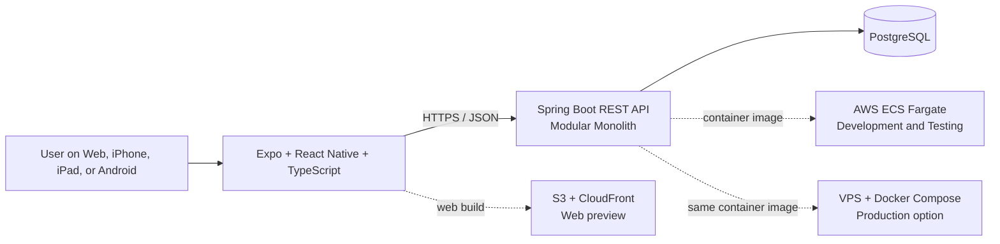
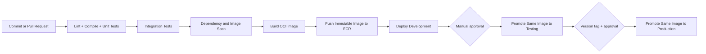

# Rikkaus Wealth OS — Architecture & Technology Decision Record

> **Document ID:** ATDR-001  
> **Status:** Accepted baseline for MVP 1A–1D  
> **Last updated:** 2026-09-02  
> **Audience:** Developers, QA, DevOps, architects, and AI agents

## 1. Purpose

This document is the technical onboarding baseline for Rikkaus Wealth OS. It records the technologies, architecture style, development tools, and deployment approach approved for the MVP.

Read this document together with [RIKKAUS_WEALTH_OS_MVP_BACKBONE.md](./RIKKAUS_WEALTH_OS_MVP_BACKBONE.md), which remains the source of truth for product scope and business rules.

If implementation differs from this document, the team must record and approve a new architecture decision before introducing the change.

## 2. Architecture summary

Rikkaus Wealth OS will use a **mobile-first client**, a **REST API modular monolith**, and **PostgreSQL**. All runtime components must be containerized so the same application can run on AWS ECS during development/testing and on a VPS for production.



## 3. Accepted technology decisions

| Area | Decision | Rationale |
|---|---|---|
| Product architecture | Modular monolith | Fastest path for MVP while retaining clear feature boundaries |
| Client platform | Expo + React Native + React Native Web | One TypeScript codebase for browser, iOS, iPadOS, and Android |
| Frontend language | TypeScript with strict mode | Safer refactoring and shared types across screens |
| Backend language | Java 25 LTS using Eclipse Temurin | Open-source LTS runtime with strong tooling and long-term support |
| Backend framework | Spring Boot 4.1.x | Mature ecosystem for REST APIs, security, persistence, and operations |
| API style | Versioned REST/JSON under `/api/v1` | Simple, testable, and well supported by mobile and web clients |
| Database | PostgreSQL 18 | Open source, reliable relational model, portable between AWS and VPS |
| Schema migration | Flyway | Repeatable, version-controlled database migrations |
| Containerization | Docker-compatible OCI images | Build once and run the same artifact in every environment |
| Development/testing runtime | AWS ECS Fargate, pay-as-you-go | Low infrastructure administration and easy environment scaling |
| Development/testing database | Amazon RDS for PostgreSQL | Managed backups, patching, and lower operational risk |
| Web preview hosting | Amazon S3 + CloudFront | Low-cost browser access for developers, QC, and PO |
| Container registry | Amazon ECR | Native integration with ECS and immutable image storage |
| Production option | VPS + Docker Compose + Caddy | Lower fixed cost after validation while preserving container portability |
| CI/CD | Jenkins LTS, Multibranch Declarative Pipeline | Pipeline as code, familiar tooling, and control over operating cost |
| Infrastructure as code | OpenTofu | Open-source, reviewable, and reproducible AWS infrastructure |

The exact patch versions must be pinned in lockfiles, Maven configuration, container tags, and CI images. Upgrades are deliberate changes; do not use `latest` tags in deployed environments.

## 4. Frontend standard

### Core stack

| Concern | Selected technology |
|---|---|
| Application framework | Expo with React Native |
| Browser support | React Native Web |
| Language | TypeScript, `strict: true` |
| Routing | Expo Router |
| UI foundation | React Native Paper with a project-specific theme |
| Server state and caching | TanStack Query |
| Local UI state | Zustand; use only when component state is insufficient |
| Forms | React Hook Form |
| Runtime validation | Zod |
| Network client | Standard `fetch` wrapped by one typed API client |
| Charts | `react-native-svg` with project-owned chart components |
| Native secure token storage | Expo SecureStore |
| Unit/component testing | Jest, `jest-expo`, React Native Testing Library |
| Browser end-to-end testing | Playwright |
| Native smoke testing | Maestro when native packages enter regular testing |
| Package manager | npm with a committed `package-lock.json` |

### Frontend rules

- Mobile layouts and touch interaction are designed first; desktop web is a responsive extension.
- Browser preview is the first MVP delivery channel. App Store and Google Play publication are not required for MVP completion.
- Business calculations remain on the backend. The client may calculate temporary display previews only.
- Remote data belongs in TanStack Query. Zustand must not duplicate API cache data.
- Shared colors, spacing, typography, currency formatting, and chart styles belong in one design-system layer.
- Native code or platform-specific packages require an explicit decision because they can break web portability.

## 5. Backend standard

### Core stack

| Concern | Selected technology |
|---|---|
| Runtime | Eclipse Temurin Java 25 LTS |
| Framework | Spring Boot 4.1.x |
| Build tool | Maven Wrapper (`mvnw`) |
| HTTP | Spring Web MVC |
| Authentication and authorization | Spring Security |
| Access tokens | Signed, short-lived JWT access tokens |
| Session renewal | Rotating refresh tokens stored hashed in PostgreSQL |
| Persistence | Spring Data JPA with Hibernate |
| Input validation | Jakarta Bean Validation |
| Database driver | PostgreSQL JDBC Driver |
| Migration | Flyway; SQL migrations committed to source control |
| API contract | OpenAPI 3 generated with a Spring Boot-compatible `springdoc-openapi` release |
| Health and metrics | Spring Boot Actuator and Micrometer |
| Unit testing | JUnit 5, AssertJ, Mockito |
| Integration testing | Spring Boot Test and Testcontainers PostgreSQL |
| Architecture enforcement | ArchUnit |
| Code coverage | JaCoCo |
| Formatting | Spotless Maven Plugin |

### Backend architecture

The backend is one deployable Spring Boot application organized **by business feature**, not by technical layer across the whole codebase.

```text
services/api/src/main/java/com/rikkaus/wealth/
├── identity/
├── settings/
├── assets/
├── liabilities/
├── cashflow/
├── goals/
├── insights/
├── dashboard/
└── shared/
```

Each feature owns its API, application services, domain logic, and persistence adapter. Features must communicate through explicit application interfaces; direct access to another feature's repository is prohibited.

### Backend rules

- Use REST resources under `/api/v1`; publish the OpenAPI contract for frontend and QA.
- Every user-owned query and mutation must enforce ownership on the server. Never trust a client-supplied `userId`.
- Store monetary values and exchange rates as exact decimal types. Never use binary floating-point for financial calculations.
- Use Flyway as the only mechanism for shared-environment schema changes. Hibernate schema auto-update is disabled outside local experiments.
- Return consistent RFC 9457 Problem Details error responses.
- Log structured operational events, but never log passwords, tokens, or financial payloads.
- Keep the application stateless except for PostgreSQL-backed data and refresh-token state.

## 6. Data architecture

- PostgreSQL is the single system of record.
- MVP entities follow the product backbone: User, UserSetting, Asset, AssetValuation, Liability, CashFlowEntry, Goal, InsightRule, InsightResult, and optional DocumentRecord metadata.
- Asset valuation history is append-only. Corrections are represented explicitly instead of silently deleting historical values.
- All timestamps are stored in UTC and displayed in the user's configured timezone.
- Identifiers use UUIDs generated by the application.
- Redis, Kafka, Elasticsearch, data warehouse, and object storage are not part of the MVP.

Development and test may share one small RDS instance to reduce cost, but must use separate databases and credentials. Production data must never be copied into lower environments.

## 7. Environments and infrastructure

| Environment | Client | API | Database | Deployment trigger |
|---|---|---|---|---|
| Local | Expo dev server and browser | Local JVM or Docker | Docker Compose PostgreSQL | Developer action |
| Development | Static web preview | ECS Fargate | RDS PostgreSQL development DB | Automatic from `develop` |
| Testing | Static web preview for QC/PO | ECS Fargate | RDS PostgreSQL test DB | Approved release candidate |
| Production | Web and/or native build | VPS Docker Compose initially; ECS remains compatible | PostgreSQL with off-host backup | Version tag plus manual approval |

### AWS development/testing components

- ECS Fargate service for the Spring Boot API.
- ECR repository for immutable API images.
- One shared Application Load Balancer for development and testing where practical.
- ACM certificates and HTTPS for all remote environments.
- S3 and CloudFront for the Expo web build.
- RDS PostgreSQL with isolated databases and credentials per environment.
- Systems Manager Parameter Store or Secrets Manager for runtime secrets.
- CloudWatch Logs for API logs and deployment diagnosis.
- OpenTofu definitions committed under `infra/aws/`.

Development and testing services should scale to zero outside active test windows where the workflow permits. Cost controls must not weaken environment isolation or expose PostgreSQL publicly.

### VPS production portability

The production option uses the same immutable API image built for ECS. A VPS deployment consists of Caddy, the Spring Boot API, and PostgreSQL managed by Docker Compose. Caddy terminates HTTPS and proxies API traffic.

The application must not depend on ECS-specific APIs. Configuration is supplied through environment variables and secrets so moving between ECS and VPS does not require code changes.

Operational database backup is mandatory even though user-facing backup/restore is outside MVP product scope. VPS backups must be encrypted, copied off-host, and periodically restore-tested.

## 8. CI/CD standard

Jenkins is configured as a **Multibranch Declarative Pipeline**. The repository-root `Jenkinsfile` is the only source of truth for build and deployment logic.



### Required pipeline stages

1. Checkout the exact commit.
2. Install pinned frontend dependencies with `npm ci`.
3. Run frontend formatting, linting, type-checking, unit tests, and web build.
4. Run backend formatting check, compile, unit tests, integration tests, and coverage.
5. Scan dependencies and the container image; use Trivy for image scanning.
6. Build one immutable OCI image tagged with the Git commit SHA.
7. Push the image to ECR.
8. Run Flyway migration as a controlled deployment step.
9. Deploy or promote the same image digest to the target environment.
10. Run API health checks and browser smoke tests.

### Branch and release policy

- Pull requests: validation only; no shared-environment deployment.
- `develop`: automatic deployment to Development after all checks pass.
- Release candidate: manual promotion to Testing for QC/PO acceptance.
- Version tag such as `v1.0.0`: manual approval before Production deployment.
- Rollback: redeploy the previous known-good image digest and compatible task definition/Compose release.

Jenkins credentials must use least-privilege AWS access. Secrets must be referenced through the Jenkins Credentials store and must never be committed or interpolated into logs.

## 9. Security and operations baseline

- HTTPS is mandatory outside local development.
- Passwords are hashed using Spring Security's supported adaptive password encoder.
- Mobile tokens use Expo SecureStore; web authentication must avoid persistent tokens in browser local storage.
- CORS uses an explicit environment-specific allowlist.
- Database credentials, token signing keys, and AWS credentials are external secrets.
- Containers run as a non-root user and expose only the application port.
- Actuator exposes only approved health and metrics endpoints; administrative endpoints are not public.
- API logs are structured and include correlation IDs without financial payloads.
- Dependency updates are automated but merged only after CI passes and a developer reviews breaking changes.

## 10. Repository target structure

```text
rikkaus-wealth-os/
├── apps/
│   └── mobile/              # Expo application for web, iOS, and Android
├── services/
│   └── api/                 # Spring Boot modular monolith
├── infra/
│   ├── aws/                 # OpenTofu for ECS, RDS, ECR, S3, and CloudFront
│   └── vps/                 # Docker Compose and Caddy configuration
├── docs/                    # Product and technical decisions
├── docker-compose.yml       # Local PostgreSQL and supporting services
├── Jenkinsfile              # CI/CD pipeline as code
└── README.md                # Developer setup and common commands
```

The repository may adopt this structure incrementally. Existing canonical product documents must not be moved until all references are updated.

## 11. Explicitly deferred technologies

The following are not approved for MVP unless a new decision record demonstrates a concrete need:

- Microservices, Kubernetes, service mesh, or event-driven distributed architecture.
- GraphQL, gRPC, Kafka, RabbitMQ, or Redis.
- Supabase, Firebase, or direct client-to-database access.
- Keycloak or a separate identity service.
- AI/LLM frameworks, vector databases, or recommendation models.
- Real-time market-data infrastructure.
- Native-only frontend forks.
- EAS cloud services as a mandatory runtime dependency; they may be adopted later for build/distribution convenience.

## 12. Developer onboarding checklist

A new developer should be able to confirm the following before starting feature work:

- Read the MVP product backbone and this decision record.
- Install the repository-defined Java, Node.js, Docker, and platform SDK versions.
- Start PostgreSQL with Docker Compose.
- Run the Spring Boot API through Maven Wrapper.
- Run the Expo app in a browser and at least one mobile simulator or device.
- Execute frontend and backend unit tests locally.
- Review the OpenAPI contract and feature-module boundaries.
- Verify that no secrets or real customer financial data are stored locally or committed.

## 13. Decision review triggers

Review this record when one of these conditions occurs:

- MVP scope changes materially.
- A native App Store or Google Play release becomes a committed milestone.
- Paying-customer load exceeds the capacity of a single application instance or PostgreSQL node.
- A regulatory, data-residency, or security requirement is introduced.
- The project adds bank, broker, market-data, document, or AI integrations.
- Moving production between ECS and VPS requires application code changes.

## 14. Official references

- [Expo SDK documentation](https://docs.expo.dev/versions/latest/)
- [Spring Boot project documentation](https://spring.io/projects/spring-boot)
- [Eclipse Temurin container images](https://hub.docker.com/_/eclipse-temurin)
- [PostgreSQL documentation](https://www.postgresql.org/docs/current/)
- [Amazon ECS with AWS Fargate](https://docs.aws.amazon.com/AmazonECS/latest/developerguide/getting-started-fargate.html)
- [Jenkins Pipeline as Code](https://www.jenkins.io/doc/book/pipeline/pipeline-as-code/)
- [OpenTofu documentation](https://opentofu.org/docs/)
- [Caddy automatic HTTPS](https://caddyserver.com/docs/automatic-https)
