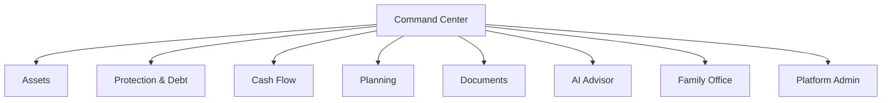
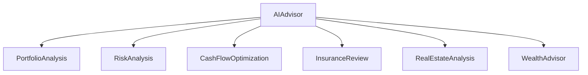
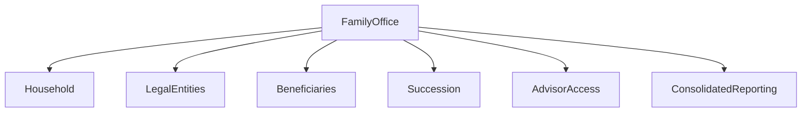
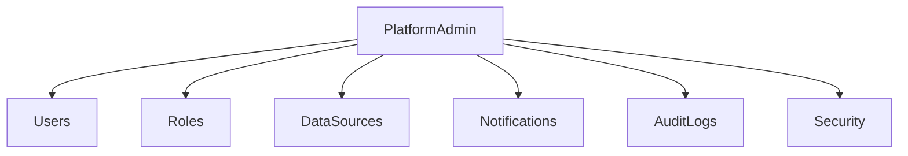

# RIKKAUS WEALTH OS v1.0
> FINAL Version 1.0 (Part 1 → Part 5)

# 1. Vision
Rikkaus Wealth OS là hệ thống quản trị tài sản cá nhân theo thời gian thực.

# 2. Product Objectives
- Quản trị tài sản
- Quản trị nghĩa vụ tài chính
- Quản trị dòng tiền
- Quản trị kế hoạch
- AI Advisor
- Family Office

# 3. Design Principles
- Single Source of Truth
- Real-time First
- Asset-centric
- Planning Driven
- AI Assisted
- Document First

# 4. Core Modules
1. Command Center
2. Assets
3. Protection & Debt
4. Cash Flow
5. Planning
6. Documents
7. AI Advisor
8. Family Office
9. Platform Admin

# 5. Assets
- Cash & Banking
- Securities
- Bonds
- Investment Funds
- Real Estate
- Valuable Assets
- Business Equity
- Collectibles

# 6. Protection & Debt
- Life Insurance
- Health Insurance
- Property Insurance
- Bank Loan
- Margin Loan
- Personal Loan
- Credit Card
- Guarantee

# 7. Cash Flow
- Income
- Passive Income
- Expenses
- Forecast

Công thức:

Tiền đầu kỳ + Thu nhập - Chi tiêu = Tiền cuối kỳ

# 8. Planning
- Financial Goals
- Retirement
- Education
- Scenario Analysis
- Stress Test
- Tax Calendar

# 9. Documents
- Digital Vault
- OCR
- Contracts
- Certificates
- Valuation Reports
- Authenticity

# 10. AI Advisor

Chức năng:
- Phân tích danh mục
- Phân tích rủi ro
- Tối ưu dòng tiền
- Đánh giá bảo hiểm
- Phân tích bất động sản
- Khuyến nghị quản trị tài sản

# 11. Family Office

## Household
- Owner
- Spouse
- Children
- Parents

## Legal Entities
- Holding Companies
- Trusts
- Foundations

## Beneficiaries
Người hoặc pháp nhân được hưởng lợi từ tài sản.

## Succession
Quản lý kế hoạch thừa kế.

## Advisor Access
Quản lý quyền truy cập của cố vấn.

## Consolidated Reporting
Báo cáo hợp nhất tài sản, nợ và hiệu quả đầu tư.

# 12. Platform Admin

Bao gồm:
- Users
- Roles
- Data Sources
- Notifications
- Audit Logs
- Security

# 13. Glossary

| Term | Meaning |
|------|---------|
| Household | Đơn vị quản lý tài chính |
| Beneficiary | Người thụ hưởng |
| Succession | Kế hoạch thừa kế |
| Advisor Access | Quyền truy cập của cố vấn |
| Consolidated Reporting | Báo cáo hợp nhất |
| Net Worth | Tài sản ròng |
| Liquidity | Thanh khoản |

# Version 1.0 Completion

- [x] Part 1
- [x] Part 2
- [x] Part 3
- [x] Part 4
- [x] Part 5

Version 1.0 hoàn thành.
