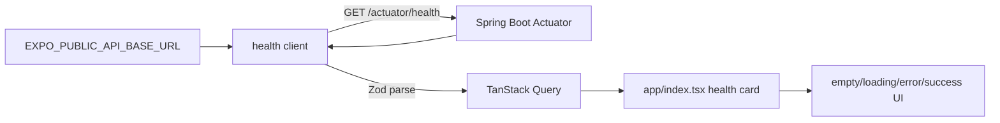

# Issue #34 frontend foundation

## Outcome

Create the first executable `apps/mobile` Expo frontend for web, iOS, and Android development. The result is a strict TypeScript Expo SDK 57 app with Expo Router, React Native Paper, TanStack Query, React Hook Form, Zod validation, a typed `/actuator/health` check, focused tests, and README onboarding.

## Source Evidence

- The accepted architecture chooses Expo, React Native, React Native Web, strict TypeScript, Expo Router, Paper, TanStack Query, React Hook Form, Zod, fetch, Jest, React Native Testing Library, Playwright, and npm lockfiles for the frontend (`ARCHITECTURE_TECHNOLOGY_DECISIONS.md:61-83`).
- Frontend rules require mobile-first layouts, browser preview as the first MVP channel, backend-owned business calculations, TanStack Query for remote data, and no duplicated API cache in Zustand (`ARCHITECTURE_TECHNOLOGY_DECISIONS.md:84-92`).
- The target repository structure places the Expo app at `apps/mobile` and keeps root onboarding in `README.md` (`ARCHITECTURE_TECHNOLOGY_DECISIONS.md:242-257`).
- #34 is the Wave 0 frontend task and can start immediately without waiting for design approval; #37, #38, and #46 follow after #34 (`RIKKAUS_WEALTH_OS_MVP_DELIVERY_BACKLOG.md:34-49`, `RIKKAUS_WEALTH_OS_MVP_DELIVERY_BACKLOG.md:141-160`).
- Product scope excludes Phase 2 imports, external APIs, real-time data, household roles, and AI advisor behavior (`RIKKAUS_WEALTH_OS_MVP_BACKBONE.md:39-60`).

Live GitHub issue body verification was attempted with `gh issue view 34` but failed because the environment could not connect to `api.github.com`; this plan uses the task prompt plus checked-in backlog as the #34 contract.

## Scope

- Create a frontend-only `apps/mobile` Expo app using the current Expo SDK 57 alignment: Node `>=22.13`, React Native `0.86`, React `19.2.3`, React Native Web `0.21.0`.
- Use `npx create-expo-app@latest --template default` as the starting point, then keep only one index route and the provider/test/docs foundation needed by #34.
- Install Expo-coupled dependencies through `npx expo install` and keep npm as the package manager with committed `package-lock.json`.
- Implement a typed `GET {EXPO_PUBLIC_API_BASE_URL}/actuator/health` client that requires `{ status: "UP" }` and tolerates additional fields.
- Render empty, loading, error, and success states for the health check, with a retry action only in the error state.

## Non-Goals

- Brand tokens, visual design system, tabs, drawer navigation, or domain application shell work for #37.
- Broad OpenAPI generated client, API error envelope, RFC 9457 handling, or typed domain client work for #38.
- Auth, session, ownership, financial domain UI, backend, Flyway, CI/CD, deployment, or Phase 2 behavior.
- Runtime fake business data, financial calculations, or placeholder domain screens.

## Public Contracts

- Environment variable: `EXPO_PUBLIC_API_BASE_URL`, documented as the base API URL without a trailing path requirement.
- Health request: `GET /actuator/health`.
- Health response: Zod schema accepts an object with `status: "UP"` and allows extra backend-provided fields.
- Developer commands: `npm --prefix apps/mobile run web`, `npm --prefix apps/mobile run build:web`, `npm --prefix apps/mobile run typecheck`, `npm --prefix apps/mobile run lint`, `npm --prefix apps/mobile test`, and `npm --prefix apps/mobile run expo:check`.

## Data Flow

No financial or user-owned data enters this flow. The only runtime network data is the operational health payload.

## Phases

| # | Phase | Status | Dependencies | File ownership |
|---|---|---|---|---|
| 1 | [Expo workspace foundation](./phase-01-expo-workspace-foundation.md) | Completed | None | `apps/mobile` scaffold, root docs/gitignore if needed |
| 2 | [Providers, health contract, and route UI](./phase-02-providers-health-route.md) | Completed | Phase 1 | App providers, health client/schema/hook, one route |
| 3 | [Tests, responsive verification, and docs](./phase-03-tests-responsive-docs.md) | Completed | Phases 1-2 | Tests, test config, README onboarding |

Phases are sequential because each phase uses files created by the previous phase. Do not parallelize edits to the same `apps/mobile/package.json`, lockfile, route, or provider files.

## Acceptance Criteria

- [x] The app starts locally on web with `npm --prefix apps/mobile run web`.
- [x] The web export/build passes with `npm --prefix apps/mobile run build:web`.
- [x] Strict TypeScript, lint, Expo dependency check, and unit/component tests pass.
- [x] Expo Router, Paper, SafeArea, and TanStack Query providers wrap the index route.
- [x] The health check uses `EXPO_PUBLIC_API_BASE_URL`, validates `{ status: "UP" }` with Zod, tolerates extra fields, and has empty/loading/error/success UI states.
- [x] Responsive behavior is verified at 375px and 1024px widths: centered content, max width 720, 16px mobile padding, 24px padding at `>=768`.
- [x] README documents prerequisites, setup, env, commands, health check behavior, testing, and troubleshooting.

## Completion Evidence

- Locked installation, strict typecheck, lint, and all four Jest suites (17 tests) passed.
- Expo dependency alignment passed; the only note was the expected offline local-map warning.
- Static web export passed for `/`, `/_sitemap`, and `/+not-found`, and a live Expo server rendered the application.
- Live responsive inspection measured 16px horizontal padding and 343px content at 375px, plus 24px padding with content capped at 720px at 1024px.
- Independent code review scored the change 9/10 with no critical findings.
- Required Expo assets, the npm lockfile, and the plan are explicitly unignored; the implementation is present in the working tree for the owning delivery session to commit.
- Root README onboarding covers the frontend while preserving the concurrently delivered backend #35 guidance.

## Test Matrix

| Layer | Coverage |
|---|---|
| Unit | Zod health schema accepts `UP` plus unknown fields and rejects missing/non-UP status. |
| Component | Index route renders missing-configuration empty, loading, error with retry, and success states through a fresh test `QueryClient` with retries off. |
| Integration | Expo Router provider path renders under tests outside `src/app`; no tests live under `apps/mobile/src/app`. |
| Build/static | Typecheck, lint, Expo dependency check, and web export/build. |
| Manual responsive | Browser/devtools screenshots or notes at 375px and 1024px confirming layout measurements and no text overlap. |

## Risks and Rollback

- High likelihood / High impact: SDK 57 dependency mismatch if packages are installed with plain `npm install`. Mitigation: use `npx expo install` for Expo-coupled dependencies and run `npx expo install --check`.
- Medium likelihood / Medium impact: create-expo-app generates routes or agent files outside the desired scope. Mitigation: use `--no-agents-md` when available and remove scaffold examples before committing.
- Medium likelihood / Medium impact: tests become flaky if Query retries or shared clients leak state. Mitigation: each test creates a fresh `QueryClient` with retry disabled.
- Low likelihood / Medium impact: backend is unavailable during local frontend work. Mitigation: tests mock fetch only in the test harness; runtime UI shows a real error state and never substitutes fake success data.
- Rollback: revert only files created or modified under the phase inventories. No database, backend, or migration rollback is required.

## Docs Impact

Update root `README.md` only because #34 changes setup commands, prerequisites, local frontend execution, environment variables, and verification commands. Do not create durable product or architecture docs for this foundation unless implementation discovers a real architecture decision that differs from the accepted baseline.

<!-- slug: issue-34-frontend-foundation -->
